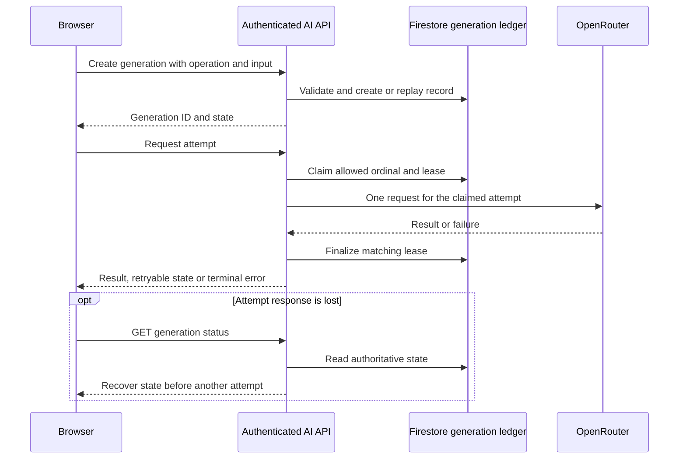

# 🛠️ Technical Documentation · Shark Empti v1.15.1

This document describes the architecture and contracts of the current source. [AUDIT_REPORT.md](AUDIT_REPORT.md) records implementation status and acceptance evidence; [CONFIGURATION.md](CONFIGURATION.md) provides setup and operational procedures.

## 🧭 Quick Navigation

| Reader goal | Read first |
|---|---|
| Determine the source of truth for a behavior or setting | Section 1 |
| Understand runtime ownership, client boundaries, and data flow | Sections 2–4 |
| Review AI behavior, user-facing safeguards, or dependencies | Sections 5–7 |
| Assess test coverage, deployment limits, and evidence | Sections 8–9 and [AUDIT_REPORT.md](AUDIT_REPORT.md) |
| Look up domain terms or follow an AI request | [Technical glossary](#technical-glossary) and [AI request lifecycle](#ai-request-lifecycle) |

The source files named in Section 1 remain authoritative when a documentation statement and executable behavior diverge.

## 1. 🧭 Scope and Authoritative Sources

| Concern | Authority |
|---|---|
| Runtime/dependency ranges | `package.json`, `.nvmrc` |
| Dependency resolutions | `package-lock.json` |
| Advisory review | `scripts/dependency-audit.mjs`, `config/dependency-audit-policy.json` |
| Desired indexes and TTL | `firestore.indexes.json`; deployed readiness requires verification |
| Next configuration | `next.config.ts` |
| Client Firebase variables | `src/firebase/config.ts` |
| Firebase Admin variables | `src/lib/firebase-admin.ts` |
| Current AI models, payload and retry orchestration | `src/ai/config/model.ts`, `src/ai/openrouter.ts`, `src/ai/error-classifier.ts`, `src/ai/generation-store.ts` |
| AI input/output contracts | `src/ai/operation-registry.ts`, `src/ai/question-schema.ts`, `src/ai/flows/*` |
| AI client protocol | `src/ai/client.ts`, `src/ai/client-flows.ts`, `src/ai/protocol.ts` |
| HTTP API contracts | `src/app/api/**/route.ts`, `src/lib/server-api.ts` |
| Firestore client authorization | `firestore.rules`, `firebase.json` |
| Persisted-data readers | `src/lib/history-schema.ts`, `src/lib/profile-schema.ts` and consumers |
| CI/test execution | `package.json#scripts`, `.github/workflows/ci.yml`, test configs |
| Route-level script budgets | `config/bundle-budgets.json` |
| Descriptive data map | `docs/backend.json`; not a validator |

When documentation differs from an executable authority above, that authority determines current behavior and documentation must be updated in the same change. `backend.json` creates no collection, index, TTL, migration or access policy.

## 2. 🏗️ Runtime Topology and Ownership

The application uses Next.js App Router. `src/app/layout.tsx` owns root HTML, fonts, global CSS, preference provider, Firebase client provider and toast infrastructure. `src/app/page.tsx` coordinates the primary learning flow; separate routes provide login, registration, profile, Forum and Arena.

`AppPreferencesProvider` owns language/theme state, validates local storage, updates `html.lang`/dark class and synchronizes storage events across tabs. `FirebaseProvider` owns one `onAuthStateChanged`; the private subtree is keyed by UID or anonymous so account changes reset private state. Preferences remain outside that subtree.

When `NEXT_PUBLIC_USE_EMULATORS` is `true`, client initialization connects Auth and Firestore to the local demo emulators. The current source does not set a Firestore long-polling option, so WebKit/emulator transport remains a runtime-validation concern. Empty toast viewport space allows pointer events through; visible notifications remain interactive.

Home owns the non-session navigation section. `useLearningSession` owns reducer transitions, stable save IDs and durable completion; `useHistory` owns the paged history source. Quiz owns answers, timer, generation/feedback UI and retries. Navigation reset/unmount invalidates late completions.

Dashboard and Playground are dynamically imported. TensorFlow.js runtime/model load only when Focus Shield is enabled. Root `error.tsx`/`global-error.tsx` and local `ErrorBoundary` handle render failure only; event, request, subscription, camera and clipboard failures must be caught at their source.

## 3. 🗄️ Data Flow and Persisted Data

Primary learning flow:

```text
Setup
  -> academic validation
  -> question generation
  -> Quiz answers/timer/feedback
  -> Result
  -> users/{uid}/history/{id}
  -> Dashboard statistics
```

Playground generates and saves flashcard/practice sessions in user subcollections. Arena creation and attempt submission use authenticated Admin APIs. Forum post creation/edit/like use client Firestore under Rules; post cascade deletion and comment creation/deletion use authenticated Admin APIs, while comment edit/like use client Rules.

### 3.1. 📁 Firestore Paths

| Path | Principal data | Current access |
|---|---|---|
| `users/{uid}` | `displayName`, `email`, `photoURL`, `bio`, `sharkCoins`, timestamps | Signed-in reads; owner writes except `sharkCoins`; Admin may increment coins |
| `users/{uid}/history/{id}` | `userId`, `schemaVersion`, `config`, `quizResults`, `totalTime`, optional `analysis`, ISO `date`, `lang` | Owner read/write |
| `users/{uid}/notes/main` | `content`, `updatedAt` | Owner read/write |
| `users/{uid}/activity/main` | `activeDays`, `updatedAt` | Owner read/write |
| `users/{uid}/flashcards/{id}` | source, cards, ISO `createdAt` | Owner read/write |
| `users/{uid}/practice/{id}` | concept, questions, answers, score, ISO `createdAt` | Owner read/write |
| `posts/{postId}` | post, author, counters, likes, timestamps | Public read; constrained client create/edit/like; Admin cascade delete |
| `posts/{postId}/comments/{commentId}` | comment, author, likes, timestamps | Read only under a live, non-tombstoned parent; Admin create/delete; constrained client edit/like |
| `arenaExams/{examId}` | title, config, questions, author, `totalAttempts` | Public read; authenticated server creation; owner client delete; browser create/update denied by Rules |
| `arenaExams/{examId}/attempts/{attemptId}` | user, score, server duration, timing version, timestamp | Public read; Admin create only |
| `_arenaSessions/{hash}` | UID, exam, server start, question fingerprint, consumed result, expiry | Admin only; 24-hour logical expiry |
| `_requestReceipts/{hash}` | fingerprint, result, createdAt, expiresAt | Admin-only; no client grant |
| `_aiGenerations/{generationId}` | owner, operation, fingerprint, validated input while active, attempt leases/outcomes, recoverable validated result/error, expiresAt | Admin-only; explicit client deny |
| `_aiQuota/{scope}` | rolling-window usage, active generation reservations, expiresAt | Admin-only; explicit client deny |
| `_forumDeletions/{postId}` | authorId, pending/complete status, timestamps | Owner read; Admin write; persistent recovery and ID-reuse protection |

The `users/{uid}/history` reader uses Zod with defaults for selected legacy omissions; records with corrupt core shape are excluded from the view rather than modified/deleted. The profile reader also normalizes selected missing fields. Forum/Arena feeds and detail views use the shared public Firestore schemas; Admin endpoints independently validate inputs and persisted parent/exam records before mutation or scoring.

`activeDays` is a `YYYY-MM-DD -> boolean` map. It records the day the activity calendar runs, not proof of quiz completion. Roadmap checks, language, theme and one-time interface guidance state live in localStorage rather than Firestore.

Roadmap writes use `shark_roadmap_checks:v2:{uid}`. Topic identity is the stored subject/grade/topic tuple; recommendation identity is its persisted bilingual text pair. Neither depends on the display locale or list index. Exact duplicate pairs collapse, while edited content creates a new task.

The previous `shark_roadmap_checks:{uid}` and unscoped `shark_roadmap_checks` keys remain unchanged. Their positional/localized identities cannot be reliably matched, so they are not imported and V2 completion starts empty. Other localStorage keys are `shark_lang`, `shark_theme`, `shark_chat_seen`, `shark_help_setup_seen`, `shark_help_dashboard_seen`, `shark_help_playground_seen` and `shark_help_forum_seen`.

### 3.2. 📅 Dates and Timestamps

- Profile, notes, posts, comments, Arena exams/attempts, Arena timing sessions, receipts, AI generations and AI quota records mainly use native Firestore/server timestamps.
- Quiz history, flashcards and practice sessions currently write ISO strings.
- `StoredDate`/format adapters accept the persisted representations needed by the UI.
- Never change date representation or backfill production data by editing `backend.json` alone.

### 3.3. ⚠️ Persistence Semantics and Limitations

- Quiz and practice await stable-ID saves before completion. Flashcard archival is awaited but failure leaves generated cards usable with an error notice.
- An object containing nested `undefined` can be rejected by Firestore.
- Post deletion now uses an authenticated server cascade with an atomic parent-removal/tombstone transaction. Local Rules deny comment reads when the parent is absent or tombstoned, including pre-existing orphans. These protections require deployment of the updated Rules; old orphan records are not silently migrated or deleted by this code change.
- `activeDays` writes use an explicit mask for the current date leaf and `updatedAt`, independently of cached maps. Emulator tests cover stale-device ordering and offline reconciliation; the day is still based on the user's local calendar.

These limitations are tracked in the audit; a descriptive data-map edit does not change finding status.

Retention policies distinguish application expiry from asynchronous storage cleanup:

| Record | Current retention or expiry contract |
|---|---|
| Request receipt | `expiresAt` is seven days after creation; retained receipts remain replayable until deletion |
| AI generation | 24-hour retention is a local/staging hypothesis awaiting operational acceptance |
| AI quota | Expiry follows the rolling-window recovery period |
| Arena timing session | API enforces a 24-hour logical lifetime, independently of delayed TTL cleanup |
| Forum deletion tombstone | No TTL; retained for owner recovery and post-ID reuse protection |

`firestore.indexes.json` declares TTL settings for the first four collections. Deployed activation remains unverified. The [configuration guide](CONFIGURATION.md#retention-operations) describes metadata inspection and legacy receipt backfill; P04 in [the audit report](AUDIT_REPORT.md) retains the historical missing-index, disabled-TTL and IAM 403 evidence.

## 4. 🔐 Authentication, Rules, and Server APIs

### 4.1. 🔑 Firebase Authentication

The client uses `GoogleAuthProvider` with popup sign-in. Successful sign-in merges the profile in a transaction. Route Handlers receive `Authorization: Bearer <Firebase ID token>` and `authenticatedUser()` verifies it through Firebase Admin Auth. Missing/invalid/expired tokens produce `AUTH-REQUIRED` or `AUTH-INVALID`.

### 4.2. 🛡️ Firebase Admin Initialization

Outside the Emulator, `src/lib/firebase-admin.ts` initializes from `FIREBASE_ADMIN_PROJECT_ID`, `FIREBASE_ADMIN_CLIENT_EMAIL` and `FIREBASE_ADMIN_PRIVATE_KEY`. In the Emulator, both Auth and Firestore host variables must exist and the project must start with `demo-`. Admin SDK bypasses Firestore Rules; API code owns authorization and validation.

### 4.3. 🏆 Arena Start and Submit APIs

`POST /api/arena` is the authenticated creation boundary. It validates the entire configuration and every question, including question-count consistency and numeric short-answer semantics, and derives author identity from Admin Auth. Direct browser exam creation/update is denied by Rules; an idempotency receipt protects retries of the same generated exam. Shared persisted-data readers reject unsafe records before rendering or scoring and tolerate missing nonessential legacy presentation metadata. Invalid records are excluded from mixed feeds with a visible error instead of failing the entire page.

`POST /api/arena/{examId}/start` accepts `{ requestId: string }` (UUID). It creates a private, user/exam-bound session with a server clock and a question fingerprint. Retrying a start retains the original clock. Sessions expire after 24 hours. The client enters the quiz only after start acknowledgement.

`POST /api/arena/{examId}/submit`

```ts
{
  answers: string[];       // maximum 500; each string maximum 2,000 characters
  requestId: string;       // UUID from the authenticated start request; required
}
```

The server reads the exam in a transaction, rejects exams without a trusted numeric-answer contract, calculates score, creates an attempt, increments `totalAttempts`, increments coins and writes the receipt in the same transaction. The same UID/scope/requestId and fingerprint returns the saved result; the same ID with a different payload returns `409 APP-REQUEST-CONFLICT`.

Initial start and both retake controls share attempt initialization. Transport retries retain the exact serialized answers and request ID; a retake clears that snapshot and receives a new ID. Account/exam changes and unmount revoke pending client completions. Exam and leaderboard subscription failures retain localized safe diagnostics and offer resubscription. Guru assistance is disabled with an explanation during an Arena attempt and is available through the contextual chatbot after completion.

Elapsed seconds are derived from server-observed start and submission receipt times, rounded upward with a one-second minimum; client `duration` values are ignored. The interval includes transport and any feedback processing before submission, not just active answering. An absent, expired, mismatched or revised-exam session is rejected; the consumed session and receipt prevent duplicate attempts and rewards. This establishes timing authority, not proof that a participant did not pre-read public exam questions.

Only attempts with `timingVersion: 1` enter the leaderboard. The Firestore query orders score descending, duration ascending and document ID ascending before `limit(10)`. Legacy attempts remain stored without retroactive timing claims. The matching index and session TTL policy are declared locally; production readiness must be checked separately. The 50-coin pioneer bonus belongs to the first successful submission globally for each exam, as stated in both locales.

### 4.4. 💬 Forum Comment and Post Deletion APIs

`POST /api/forum/{postId}/comments`

```ts
{ content: string; requestId?: string }
```

Content is trimmed and constrained to 1–2,000 characters. The API verifies the token, obtains identity from Admin Auth, creates a comment and increments `commentsCount` in an idempotent transaction.

`DELETE /api/forum/{postId}/comments?commentId={commentId}` verifies token, existence and `authorId`, then deletes the comment and decrements the counter transactionally. Comment creation validates the parent and rejects deletion-in-progress within its transaction.

`DELETE /api/forum/{postId}` verifies ownership and atomically removes the parent while creating `_forumDeletions/{postId}`. Admin SDK recursive deletion then removes descendants in bounded bulk operations.

The minimal tombstone contains `authorId`, status and timestamps. It prevents ID reuse and authorizes retries after partial failure. Only its owner can read it; clients cannot mutate it. The Forum interface supports recovery of pending deletions, and there is no background cleanup worker. Tombstones have no TTL because expiry would reopen ID reuse; they must remain until a replacement policy exists. Deploying code alone does not clean up production data.

### 4.5. 🚨 Safe Errors

`apiFailure()` returns `{ error, code, values }` JSON. Configuration failure is 503, input parse failure is 400, domain `ApiError` retains its declared status, and unknown failure becomes 500 `APP-REQUEST-FAILED`. Responses must not contain tokens, private keys, raw stacks or provider bodies.

## 5. 🤖 AI Transport and Validation

Seven public operations exist: academic validation, question generation, flashcard generation, practice generation, short-answer analysis, personalized quiz feedback and AI coaching chatbot. Browser callers use the shared client state machine in `src/ai/client.ts`; they do not select models or attempt ordinals.

`POST /api/ai/generations` authenticates the Firebase ID token before bounded JSON parsing, validates the operation input through the server-only registry and creates or replays an idempotent short-lived record. `POST /api/ai/generations/{generationId}/attempt` transactionally claims one of at most three attempts, calls `requestStructuredOnce()` outside the transaction and finalizes only a matching lease. `GET` recovers status/results after response loss, and `DELETE` records cancellation. Browser access to `_aiGenerations` and `_aiQuota` is denied by Rules.

Current model priority:

```text
thinkingmachines/inkling:free
google/gemma-4-31b-it:free
nvidia/nemotron-3.5-lightning:free
```

Gemma receives native JSON Schema; Inkling/Nemotron receive a JSON-only instruction. Each adapter invocation makes at most one OpenRouter request, checks non-2xx responses and embedded error envelopes, parses supported JSON forms and validates the operation-specific output schema and cross-field rules. Normalized failures are classified as terminal, retry-next-model, retry-after or cancelled before another claim is permitted.

The provider deadline is 20 seconds and the lease is 35 seconds. The ledger enforces two concurrent generations per user, a staging-hypothesis budget of 30 weighted attempts per 15 minutes and a global ceiling of 300. The protocol is enabled by default outside production; production creation requires `AI_GENERATION_PROTOCOL_ENABLED=true`. Visitor warm-up and process-scoped model preference do not exist. Deployment duration, quota calibration, TTL activation and canary acceptance remain pending and must not be inferred from local tests.

Chat review context occurs once in the system message, prior conversation turns once in provider messages, and the current user input once at the end. The caller supplies prior turns without appending the current turn to history.

<a id="ai-request-lifecycle"></a>

### 5.1. AI Request Lifecycle



The diagram shows a successful claim. Authentication, validation, quota rejection or an active lease can end an invocation before any provider request. The browser follows the returned state and delay; the server determines whether another ordinal is available. Cancellation is recorded through `DELETE` and may remain `cancel_requested` while an attempt is active. A cancellation request does not guarantee that an already dispatched provider request stops immediately.

## 6. 🖥️ Client Behavior, Internationalization, and Focus Shield

Profile biography drafts belong to one mounted account session. `useProfileBio` protects edits through delayed snapshots and failed saves, waits for acknowledgement before resuming pristine synchronization, and revokes old save completions. `useDoc` hides snapshots from a previous document path immediately when account ownership changes.

`translations.ts` retains domain copy; `src/lib/i18n` retains common/error/UI messages. Tests enforce VI/EN key and interpolation parity. Brand names, error codes, model identifiers, scientific notation, LaTeX and user content are not automatically translated. Locale changes do not regenerate or translate history.

Quick Notes retains a dirty draft across snapshots and reports success only after the write completes. Forum creation and coordinated edits/deletion use pending locks; editors retain drafts until persistence is confirmed. Setup academic validation uses a versioned configuration snapshot and a synchronous submit lock. Configuration, locale, callback ownership changes and unmount revoke older results, including late failures. This prevents stale client transitions; it does not claim cancellation of upstream AI work.

Report selection and roadmap checkboxes have one semantic state-change owner. Printed reports use an independent body-level print surface rather than the dialog scroll area, with print-specific colors, unconstrained flow and page-break rules. Chart values are represented as tables in print. The opt-in `tests/report-print.browser.test.tsx` accepts `REPORT_PRINT_BROWSER=chrome|msedge|chromium|firefox|webkit`; Chromium PDF output goes to ignored `tmp/pdfs/`. Browser/PDF acceptance must be distinguished from DOM regression tests.

Focus Shield:

- starts only after user action;
- requires a secure context (`https` or `localhost`) and camera permission;
- dynamically imports TensorFlow runtime/model;
- uses generation/start guards to reject late resources;
- stops tracks, cancels animation frames, detaches video and disposes the owned model on stop and initialization/playback/inference failures;
- presents localized recoverable failures and allows a fresh session on retry; the owned-resource lifecycle is covered by 55 focus/camera regression tests;
- preserves the shared TensorFlow backend rather than globally disposing resources another consumer may own;
- uses `tf.tidy` and an 800 ms inference throttle.

A recorded headed-Chromium check used the local HP Wide Vision HD Camera, produced 640 × 480 video in two start/stop cycles and verified all tracks ended. This does not establish other devices, lighting, permission revocation or exact minimum browser versions.

## 7. 📦 Dependency Boundaries

`package.json` is the authority for direct dependency ranges, and the lockfileVersion 3 `package-lock.json` is the authority for resolved direct and transitive versions. Repeating the complete inventory here caused version facts to drift without adding architectural context.

The main runtime groups are Next.js and React, Firebase client/Admin SDKs, Zod validation, Radix UI primitives, TensorFlow.js, KaTeX and Recharts. The development toolchain comprises TypeScript and ESLint, Vitest and Testing Library, Firebase Emulator tooling, Playwright, Tailwind/PostCSS, coverage and TSX execution. Consult the manifest and lockfile for exact versions.

For upgrades, review runtime engines, peer ranges, changelogs, advisories and affected consumers; then perform a clean install and run the relevant validation layers. Avoid adding a dependency for behavior already provided by the supported platform or Node runtime.

## 8. 🧪 Testing, CI, and Deployment Limitations

| Layer | Config/script | Scope |
|---|---|---|
| Static | `npm run lint`, `npm run typecheck` | ESLint and TypeScript |
| Unit/component | `npm test` | jsdom/node fixtures; no production network |
| Coverage | `npm run test:coverage` | V8 for instrumented suite; not the complete system |
| Rules | `npm run test:rules` | Firestore Rules through Emulator |
| Integration | `npm run test:integration` | Auth/Firestore Emulator and server APIs |
| E2E | `npm run test:e2e` | Next dev or production server, demo Firebase, AI fixture; Chromium desktop/mobile, WebKit and Firefox |
| Print layout | `REPORT_PRINT_BROWSER` plus `node node_modules/vitest/vitest.mjs run tests/report-print.browser.test.tsx` | Opt-in browser fixture; both languages/themes; Chromium PDF output; see configuration guide for PowerShell syntax |
| Build | `npm run build` | Optimized Next artifact; no font-network dependency |
| Production smoke | `npm run test:production` | Six page routes, referenced script chunks, bundle budgets and unauthenticated Arena/AI API behavior |
| Bundle/performance | `npm run report:bundle`, `npm run report:performance` | Build inventory and synthetic dataset baseline; not browser interaction timing |
| Dependency assessment | `npm run audit:dependencies` | Registry report tied to the lockfile hash; policy blocks high/critical findings and registry errors |
| Infrastructure metadata | `node scripts/inspect-firestore.mjs` | Read-only deployed posts/Arena index and receipt/AI/Arena-session TTL inspection |
| Receipt expiry inventory | `node --conditions=react-server --env-file=.env --import tsx scripts/receipt-retention.ts` | Read-only by default; `--apply` only backfills missing expiry values |
| Browser measurement | `npm run report:browser`, `npm run report:comparison` | Production guest-route cold/warm, heap, DOM, resource and Forum input timing; historical comparison requires a separately built checkout |
| Query comparison | `npm run report:queries` | Local demo Emulator, 100/1,000/10,000 records, unbounded versus 50-record queries |
| Physical camera | No checked-in command | Requires independent device verification |
| Live AI adapter | `npm run ai:smoke` | Live OpenRouter and operation schemas; quota/cost possible; does not exercise auth, ledger or recovery |

CI runs `npm ci → dependency audit → lint → typecheck → coverage → integration → build → install Chromium/WebKit/Firefox → development E2E → production E2E → bundle report → production HTTP smoke → synthetic performance baseline` on Ubuntu with Node 24/JDK 21. Browser-performance and query-comparison commands run independently under controlled measurement conditions. Workflow configuration does not prove a successful hosted run.

The existence or success of a test suite does not establish remote CI, deployed Firestore indexes/Rules, production Vercel runtime, Safari/Firefox minimum versions, physical-camera behavior, live-provider reliability or current vulnerability applicability. Those device/browser limits remain V02 validation scope; they do not change the completed Focus Shield lifecycle remediation recorded as F11. Builds use local system font stacks and do not require Google Fonts.

## 9. 📑 Implementation and Validation Evidence

History versions 1 and 2 remain readable; absent versions identify legacy records, and unknown future versions are rejected. Numeric quiz settings are validated separately from draft and persisted strings. `usePagedCollection` limits initial live subscriptions to 50 records and cursor-fetches older pages on demand. Statistics, search and report labels describe loaded-record scope.

This document defines the implemented architecture and the validation layers available in the checkout. Dated test results, finding-level evidence and unresolved acceptance criteria belong in [the audit report](AUDIT_REPORT.md); executable commands and environment requirements belong in [the configuration guide](CONFIGURATION.md). A historical result must not be treated as proof of current remote CI, deployed Firestore configuration, production runtime behavior, live-provider reliability or physical-device compatibility.

<a id="technical-glossary"></a>

## 10. 📖 Technical Glossary

| Term | Meaning in this repository |
|---|---|
| Generation | One AI operation, with validated input, an owner and at most three server-ordered attempts |
| Generation ledger | Private Firestore records that coordinate generation state, leases, cancellation and recoverable results |
| Attempt | In AI, one claimed model ordinal; in Arena, one scored quiz submission. These are separate records and lifecycles |
| Lease | Temporary ownership of an AI attempt; only a matching lease may finalize its result |
| Idempotency receipt | Stored request fingerprint and result used to replay a mutation without duplicating its effects |
| Fingerprint | A representation used to compare request content or exam questions and detect incompatible reuse |
| Quota reservation | Transactional accounting for concurrency and weighted AI usage; it is separate from provider account limits |
| Tombstone | Persistent Forum deletion record that supports owner recovery and prevents reuse of a deleted post ID |
| TTL | Firestore's asynchronous deletion policy for an expiry field; distinct from expiry checks enforced by API code |
| Loaded-record scope | Search, statistics and reports cover fetched records; older pages are included only after loading |
| Historical evidence | A result tied to an earlier revision or environment, retained for traceability rather than assumed current |
| Staging / canary | Pre-release validation environment / limited production exposure with defined acceptance and stop criteria |
